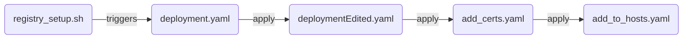

# Edge Registry  
  
## Description  
**Edge registry** aims at providing a localized Docker registry using Edge storage (edge storage component) as its file storage backend.  
It is using Kubernetes containerization in order to provide its services, creating a new pod in the Edge storage namespace that is able to connect to the Minio storage backend.  
In addition, Edge registry creates a set of secrets that allows the secure communication between the registry and its clients using the HTTPS protocol and a basic authentication scheme.  
  
  
## Setup  
In order to setup Edge registry, an active Edge storage deployment must be present in a targeted cloud or on a single node.  

A bucket named *"registry-edge"* must be present in the Edge storage environment.  (Connect to the MinIO console and create the bucket.)

Make the installation script executable:
```sh
sudo chmod +x ./registry_setup.sh
```
Execute the installation script:
```sh
sh registry_setup.sh
```

After the successfull installation the commands:

 - `update-ca-certificates`   
 - `systemctl restart containerd`

should be executed on each client in order to ensure that the SSL certificates are updated.  
  
### Installation Procedure


## Test the Installation

After the successful installation of the Edge registry, terminal outputs the location where the registry is listening (e.g. [*`yourIP:5045`*])

Note: replace `yourIP` with your actual IP
Log in to the local Docker registry using the following command:

    sudo docker login yourIP:5045

The credentials are:

 - Username: regUser
-  Password: regPass5

In order to _push_/_pull_ an image to the local Docker registry, use the following commands (_hellow-world_ image is used as an example):

-   `sudo docker run hello-world`
-   `sudo docker tag hello-world yourIP:5045/hello-world`
-   `sudo docker push yourIP:5045/hello-world`
-   `sudo docker pull yourIP:5045/hello-world`

### Docker Registry API V2

The local Docker registry provides an API to interact with the registry. This API contains the various endpoints used in the background by the Docker CLI to perform various tasks like pulling, pushing, and tagging images. We can also use these endpoints directly to interact with a registry without using the Docker CLI.

Full documentation can be found here:  [Docker Registry](https://docs.docker.com/registry/)

For example, to list images in the local Docker registry, we can use the  `_/catalog`  endpoint.

-   Connect to the node, access the terminal and type:
    
    -   `curl -k https://yourIP:5045/v2/_catalog`
        
        > {“repositories”:[“hello-world”]}
        
-   Open a browser (Firefox or Google Chrome in Incognito mode):
    
    -   https://yourIP:5045/v2/_catalog

### MinIO Console

MinIO is used as the storage backend for the local Docker registry. After successfully pushing the example  _hello-world_  image:

-   Open the MinIO console
-   Access the  `registry-ches`  bucket
-   The pushed images will be available within this bucket

## Integrating Local Docker Registry with Kubernetes

Kubernetes has been seamlessly integrated with the local Docker registry to streamline container deployment workflows.

### Example Usage

This example demonstrates a single-pod Deployment named  `registry-test`, which runs a container based on the  `yourIP:5045/hello-world:latest`  image. It pulls the  _hello-world_  example image from the local Docker registry.

```yaml
apiVersion: apps/v1
kind: Deployment
metadata:
  name: registry-test
  namespace: ches
  labels:
    app: registry-test
spec:
  replicas: 1
  selector:
    matchLabels:
      app: registry-test
  template:
    metadata:
      labels:
        app: registry-test
    spec:
      containers:
      - name: registry-test
        image: yourIP:5045/hello-world:latest
      imagePullSecrets:
        - name: ches-registry-secret
```

## License  
Edge registry is published under the [AGPL V3 licence](https://www.gnu.org/licenses/agpl-3.0.txt).