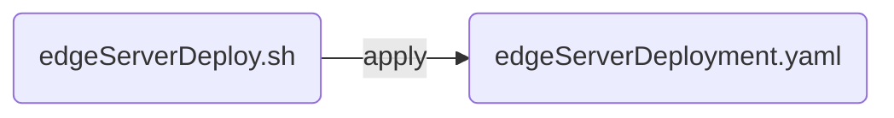
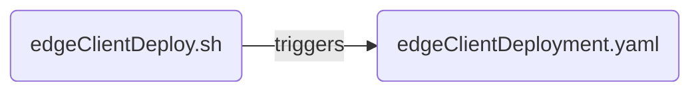

# Edge Storage Component  
  
This is the Edge Storage component. It aims to provide storage capabilities, utilizing the edge resources and optimizing the data transfer, caching and storage.  

More info for the System Architecture is provided in `SystemArchitect.md` file.

# Installation  
  
## Single node cluster  
  
The file `singleClusterInstallScript.sh` is a self-contained installation script for a single node cluster deployment.  

Make the installation script executable:

```sh
sudo chmod +x ./singleClusterInstallScript.sh
```
Execute the installation script:

    sh singleClusterInstallScript.sh
  
## Multi-node cluster  
  
For multinode clusters the `edgeServerDeploy.sh` should be used.   

In order for it to be used a manual configuration need to be carried out before it's execution.  

The configuration includes:  
* Defining the data path for data storage in the storage workers, which includes creating the necessary folders and setting the access rights in a way that Kubernetes is able to read and write into this path.  
     - Example: Create a folder `/data/test` and give access permissions with `sudo chmod 775 /data/test`    
* Set the data path in the edge storage config file `edgeConfig.conf` (`"data-path"` field)
* Add the label `edge-storage-worker=true` to all storage worker nodes.  
* Add the label `edge-storage-master=true` to the storage master node.  
    - How to label nodes? 
        - `kubectl get nodes` returns the nodes of the cluster   
        - `kubectl label node [name of the node]` `ches-worker=true` or `ches-master=true`

Make the installation script executable:

```sh
sudo chmod +x ./edgeServerDeploy.sh
```
Execute the installation script:

    sh edgeServerDeploy.sh

 


Please make sure that everything is up and running. To ensure execute:

     kubectl get pods -A

In case that the STATUS is *ContainerCreating* and/or *PodInitializing* please wait until everything is up and running. Check periodically with the command mentioned above.

## Test the installation

Get datasets

     kubectl get datasets -A


> expected output:

    NAMESPACE   NAME            AGE
    default     edge-data    23m


Get pvc(s) in ches namespace

     kubectl get pvc -n ches

> expected output:

    NAME          STATUS    VOLUME                                     CAPACITY   ACCESS MODES   STORAGECLASS   AGE
    data-edgestorage-0   Bound     pvc-269dc91f-57dc-4d5a-9532-c15dcebc4885   1Gi        RWO            local-path     27m

Get the Dataset CRD

     kubectl get pvc

> expected output:

    NAME            STATUS   VOLUME                                     CAPACITY   ACCESS MODES   STORAGECLASS   AGE
    edge-data    Bound    pvc-af0b3841-97ea-4384-9548-8f79bdb61a20   9314Gi     RWX            csi-s3         2m42s


*If this command does not results the expected output something might gone wrong. Undeploy the cluster by running `sh edgeServerUndeploy.sh` and do the installation process again*

## Create Root User and Password (optional)

In `edgeConfig.conf`, there are already stored the access credentials for MinIO.
The username and password of the root user need to be created as secrets and
provided as environment variables. These need to be in base64 format in order to be created as secrets in Kubernetes.

In order to create new credentials (optional, better use the defaults that already exist):
```sh
$ echo -n 'my-access-key' | base64
bXktYWNjZXNzLWtleQ==
$ echo -n 'my-secret key' | base64
bXlYWFh4eHgvc2VjcmV0WFhYWHh4eC9rZXlYWHh4eA==
```

## File Sharing and Live Syncing

## Create a Pod and connect it to the Dataset CRD

Make the client deployment script executable:

 ```sudo chmod +x ./edgeClientDeploy.sh```
 
#### Client Installation Procedure


Make sure that

```yaml
persistentVolumeClaim:
 claimName: [your-dataset]
```

in edgeClientDeployment.yaml file  has the correct value returned from`kubectl get pvc` command.

Execute the client installation script and wait until pod is up and running:

     sh chesClientDeploy.sh

Connect to client pod:

     kubectl exec --stdin --tty [name_of_pod] -- /bin/bash

The `[name_of_pod]` corresponds to the

```yaml
metadata:
 name: [name_of_pod]
```

in edgeClientDeployment.yaml file.


See the contents of folder:

     ls -la /data/test/

Create a file inside the folder:

     echo "This is a file for testing" > /data/test/my_test_file.txt

 
Then connect to the MinIO Console with the credentials mentioned above in order to see the newly created file.


## License  
Edge Storage is published under the [AGPL V3 licence](https://www.gnu.org/licenses/agpl-3.0.txt).